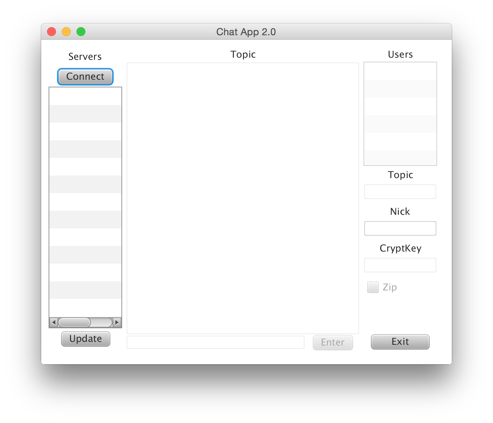

# Chat-Server-and-Client
A chat server and client made in Java

This was a school project by me and <a href="https://github.com/mattiasedin">Mattias Edin</a> for the course Data Communication and Datanet, taken at Umeå University of Sweden.

We developed a chat system, both width server and client, where the client have a graphical user interface. You can see the report, though sadly in swedish, in <a href="doirapport.pdf">doirapport.pdf</a>.

# Server
We developed our own pakages and sent them over TCP protocol, we used threads to keep up with multiple users.

# Client
Also implemented the TCP protocol and made it posible to set and change nickname and topic of a server.

